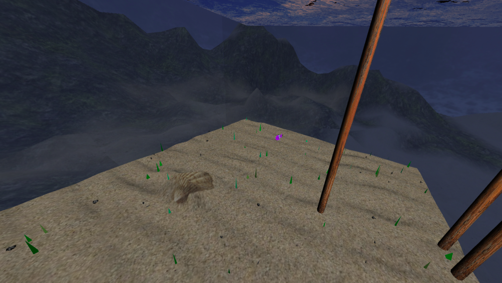
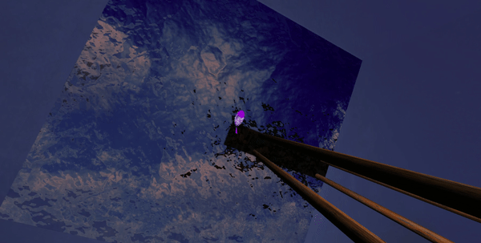

# CGRA 2020/2021

## Group T02G01
Sofia Teixeira (up201806629)

---------

## **Project**
### Cena do fundo do mar
Este projeto foi realizado no âmbito da Unidade Curricular de Computação Gráfica, lecionada no segundo semestre do segundo ano do MIEIC.

**Funcionalidades Implementadas**:
* Parte A
    * Objeto Controlável;
    * Ambiente utilizando o MyCubeMap;
    * Cilindro sem topos;
    * Esfera;
    * Controlos adicionais na interface;
* Parte B
    * Modelação do peixe;

    
    
    * Animação do peixe;

    

    * Fundo de areia;
    * Ninho do peixe;

    

    * Superfície da água;

    
    

    * Pedras;
    

    * Pilares;
    

    * Novas texturas do MyCubeMap;
    * Algas;
    * Peixe controlado pelo teclado;
    * Ajuste das animações ao comportamento do peixe.

**Funcionalidades por implementar**:
* Recolha de pedras;
* Funcionalidades adicionais.

Panorâmica geral da cena:

**Nota**:
As imagens utilizadas no trabalho não são da minha autoria. Os conjuntos de imagens do [demo_cubemap](./project/images/demo_cubemap), [test_cubemap](./project/images/test_cubemap), [underwater_cubemap](./project/images/underwater_cubemap), bem como as imagens [distortionmap.png](./project/images/distortionmap.png), [earth.jpg](./project/images/earth.jpg), [pier.jpg](./project/images/pier.jpg), [sand.png](./project/images/sand.png), [sandMap.png](./project/images/sandMap.png) foram fornecidas pelos docentes da unidade curricular e as restantes foram utilizadas a partir das seguintes fontes:
[seaShell.png](https://pngimg.com/image/37104); [scales.jpg](https://images.fineartamerica.com/images/artworkimages/mediumlarge/2/15-fish-scales-pattern-jared-davies.jpg); [eye.jpg](http://billjohnsononline.com/wp-content/uploads/2017/03/The-Black-Dot-Experiment-945x544.jpg); [rustyMetal.jpg](https://previews.123rf.com/images/pacomr/pacomr1811/pacomr181100062/114633669-rusty-metal-textured-old-metal-iron-rust-background-and-texture-metal-corroded-texture-rusty-metal-b.jpg). As imagens utilizadas para o efeito do fundo do mar foram modificadas por mim através de uma colagem simples das imagens acima referidas ([sand1.png](./project/images/sand1.png); [sandMap1.png](./project/images/sandMap1.png); [sandMapColor.png](./project/images/sandMapColor.png)).
