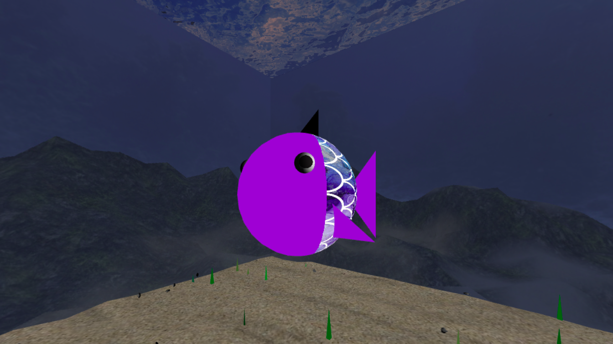

# CGRA 2020/2021

## Group T02G01
Sofia Teixeira (up201806629)

---------

## **Project**
### Cena do fundo do mar
Este projeto foi realizado no âmbito da Unidade Curricular de Computação Gráfica, lecionada no segundo semestre do segundo ano do MIEIC.

**Funcionalidades Implementadas**:
* Parte A
    * Objeto Controlável;
    * Ambiente utilizando o MyCubeMap;
    * Cilindro sem topos;
    * Esfera;
    * Controlos adicionais na interface;
* Parte B
    * Modelação do peixe;

    
    
    * Animação do peixe;

    

    * Fundo de areia;

    

    * Ninho do peixe;

    

    * Superfície da água (ainda não está completamente terminado, falta a animação);

    

    * Pilares;
    
    
    * Novas texturas do MyCubeMap (ainda não está completamente terminado, falta ajustar a cor da superfície da água com a cor do fundo);

**Funcionalidades por implementar**:
* Parte B
    * Pedras;
    * Algas;
    * Controlos e animações adicionais;
    * Funcionalidades adicionais.

Estado atual da cena:

<!---Atualizar créditos para os autores das fotos--->
